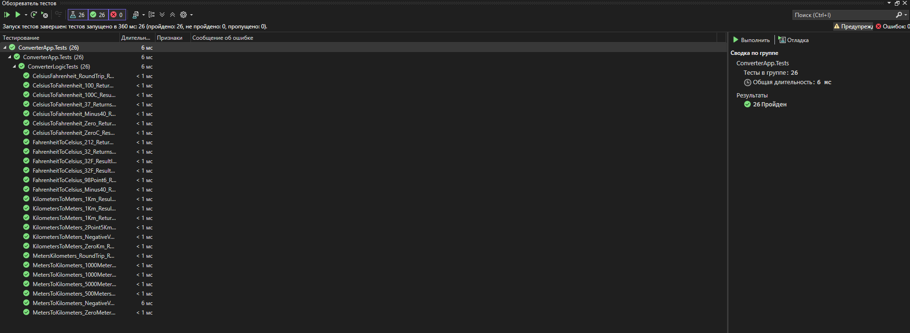

# Конвертер величин — Вариант 2

## Информация о студенте

| Поле | Значение |
|------|----------|
| ФИО | Третьяк Егор Николаевич |
| Вариант | Вариант 2 |
| Дисциплина | МДК.01.02 Поддержка и тестирование программных модулей |

## Описание проекта

Графическое WPF-приложение «Конвертер величин», которое позволяет конвертировать:
- Метры → Километры
- Километры → Метры
- Градусы Цельсия → Градусы Фаренгейта
- Градусы Фаренгейта → Градусы Цельсия

## Структура решения
'''
ConverterApp/
├── ConverterApp/              # WPF-приложение
│   ├── MainWindow.xaml        # Интерфейс
│   ├── MainWindow.xaml.cs     # Обработчики событий
│   └── ConverterLogic.cs      # Логика конвертации
└── ConverterApp.Tests/        # Тестовый проект MSTest
└── ConverterLogicTests.cs # 26 автоматизированных тестов
'''
## Результаты тестирования

Все 26 тестов пройдены успешно.

## Тестовые сценарии

Файл с ручным тестированием: `testing-scenarios.docx`
